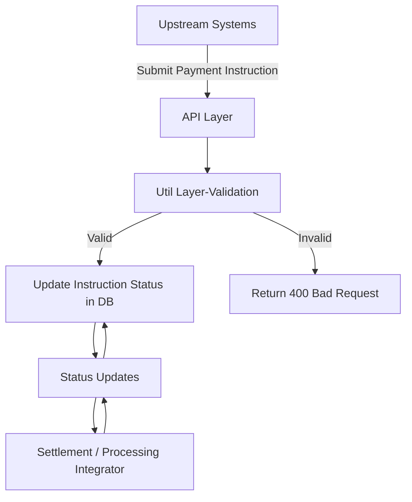

# Product System Design &amp; Implementation Assessment
## Task 1: Problem Framing & Assumptions

## 1. Key Assumptions

### 1.1 Expected transaction volume and peak behaviour
- Since it involves internal and external clients, initial payment instruction could reach 1k-10k per day
- System needs to scale as external clients grow up to millions of payment instructions per day
- Traffic will peak when performing end of day settlements/reconcillations.
- System will need to do:
  - Horizontal scalability
  - Schedulers / async processing

---

### 1.2 Ordering, idempotency, and duplicate handling
- Payment instructions will not come in order for all accounts (Internal + External)
- `Instruction ID` and `Source system` will act as **idempotency key** to prevent duplicates
- In the event of duplicate submissions for payment instruction:
  - System needs to detect and perform action to prevent duplicate payment instructions
  - Return existing payment instruction status when required
  
---

### 1.3 Data integrity, audit, and compliance requirements
- Payment instructions must strictly not perform `hard delete`, where it will only perform `soft delete` when required/requested
- For audit:
  - Payment instruction may include additional `Source creation date` to log date of creation for each payment instruction in the system
  - Record whenever instruction status changes (new+old value) with its timestamp
- For compliance:
  - All instructions must be tracable
- For Operation Expectation:
  - High availability with near zero downtime for critical services
  - Failed/Pending payment instructions must be able to reprocess itself without manual intervention unless required

---

## 2. Clarifying Questions

### 2.1 Product or business stakeholders
- What is the SLA for payment instructions processing / reprocessing for failed payment instruction?
- Do we accept any currency value?
- Is payment instruction cancellable or amendable? Under what condition?

---

### 2.2 Enterprise Architecture
- Any preference on requirement on Database / Message Queue Platforms?

---

### 2.3 Platform, infrastructure, or security teams
- Any preferred authorization services? (OAuth2 / etc.)
- Any required reporting/dashboard for viewing/tracing?
- Tools to be used for securing sensitive data? (HSM/KSM)

---

## Task 2: Core Implementation
- Use Demo/PaymentService.exe
- After launching, use browser to go to http://localhost:5000, it will open a swagger page where you can utilize the API calls.

---

## Task 3: System & Integration Design

### 1. Major Components

| Component | Responsibility |
|-----------|----------------|
| **API Layer (PaymentController)** | Exposes REST endpoints for submission of payment instructions and retrieval of payment instruction status. |
| **Util Layer (PaymentInstructionUtil)** | Include utility like validation of payment instruction request. |
| **DB Layer (DBUtil / EF Core)** | Manage storage of payment instructions. |
| **Processing Queue** | Handles asynchronous delivery of instructions to downstream systems. |
| **Downstream Integration** | Interfaces with settlement system. |
| **Monitoring & Logging** | Captures operational errors, and audit logs. |

---

### 2. Data Flow

---

### 3.Integration Points
| Direction | Integration Point | Description |
|-----------|-------------------|-------------|
| **Upstream** | Internal Business Teams / External Clients | REST endpoints for submission of payment instructions and retrieval of payment instruction status. |
| **Downstream** | Settlement / Processing Systems | Via message queues with retries on failure/network timeout. |

---

### 4. Failure handling
| Scenario | Action |
|----------|--------|
| **Validation failure** | Reject instruction with `400 Bad Request` and show error message. |
| **Database failure** | Rollback transaction; Log and alert error. |
| **Duplicate instruction** | Detect via composite key (`InstructionId + SourceSystem`) and return `200 OK` for idempotency. |
| **Downstream delivery failure** | Retry via messaging queue. |

---

## Task 4: Data Integrity & Operability

## 1. Data Integrity

### 1.1 Idempotency
- Payment instructions is uniquely identified by `Instruction ID` and the `Source system`
  - Repeated payment instructions with similar `Instruction ID` must result in only one transaction record and with same `Instruction status`
  - Do no trigger any processing for duplicated `Instruction ID`

---

### 1.2 Auditability
- All processing done on payment instructions must be recorded:
  - Previous value
  - New value
  - Timestamp of processing

---

### 1.3 Reconcilation
- Discrepancies are alerted and require manual intervention

---

## 2. Operability

### 2.1 Operational metrics or signals
- System Load
  - To ensure system load is balanced and will not overload during peak Traffic
- Error/Failure Rate
  - Measure and record error/failure so that it is below expected baseline and raise immediate investigation when it goes beyond the targeted baseline
- Processing Time
  - Ensure all payment instructions is processed within targeted time

---

## 3. Issue detection, investigation and resolution

### 3.1 Detection
- Issues are detected based on the above metrics/signals by monitoring them

---

### 3.2 Investigation
- Support team will investigate based on the following:
  - `Instruction ID`
  - Processing audit trail (status change)
  - Available logs

---

### 3.3 Resolution
- Ability to reprocess failed instructions via system
- Manual resolution must be recorded/reported